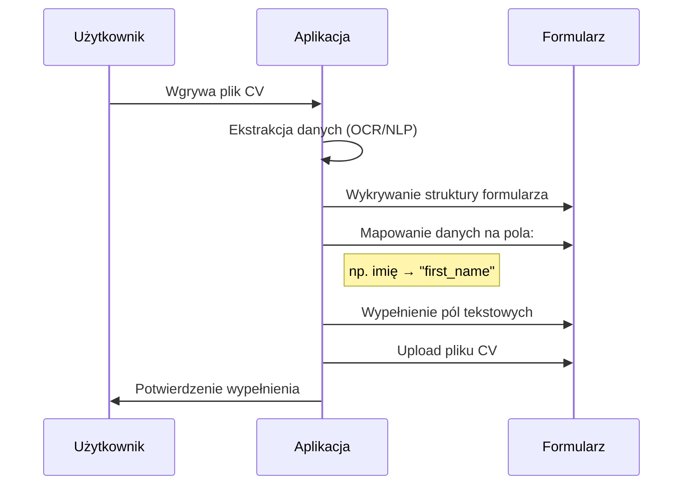
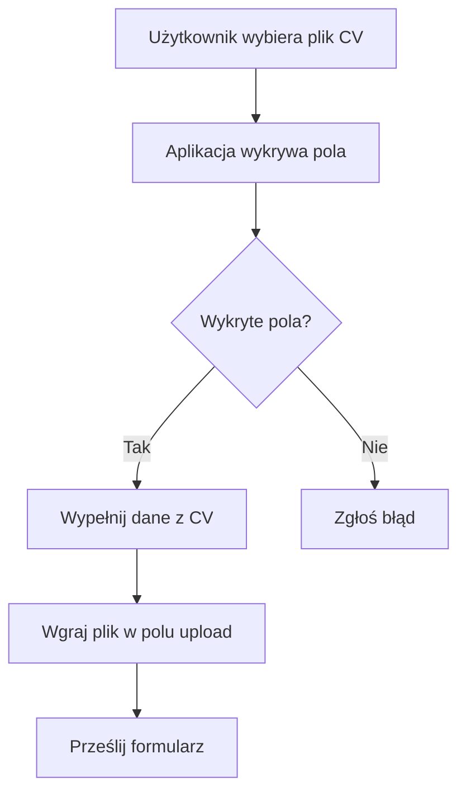

# Jak działa detekcja pól w formularzach i wypełnianie

## Proces wypełniania formularza na podstawie CV

```ascii
+-----------------+     +-------------------+     +---------------------+
|   Użytkownik    |     |     Aplikacja     |     |     Serwis Webowy    |
|-----------------|     |-------------------|     |---------------------|
| 1. Wgrywa CV   |---->| 2. Ekstrahuje dane|---->| 3. Wykrywa pola     |
| (PDF/DOCX)      |     | (imię, email,     |     | formularza          |
+-----------------+     | doświadczenie)    |     +---------------------+
                         |                   |             |             |
                         +-------------------+             v             v
                         | 4. Mapuje dane    |     +---------------------+
                         | na pola formularza|---->| 5. Wypełnia pola    |
                         +-------------------+     | automatycznie       |
                                                   +---------------------+
                                                             |
                                                             v
                                                   +---------------------+
                                                   | 6. Wgrywa plik CV   |
                                                   | do pola upload      |
                                                   +---------------------+
```

## Diagram sekwencji w Mermaid



## Kluczowe komponenty

1. **Detekcja pól**:
   - Analiza HTML/CSS formularza
   - Identyfikacja typów pól (text, email, file, etc.)
   - Mapowanie etykiet na struktury danych

2. **Ekstrakcja danych z CV**:
   - Przetwarzanie NLP do identyfikacji sekcji
   - Rozpoznawanie encji (imiona, firmy, daty)

3. **Mapowanie danych**:
   - Dopasowanie ekstrahowanych danych do wykrytych pól
   - Obsługa różnic w strukturze (np. "imię" vs "first_name")

4. **Wgrywanie plików**:
   - Automatyczne znalezienie pola file upload
   - Wgranie pliku z dysku użytkownika

## Przykład użycia

