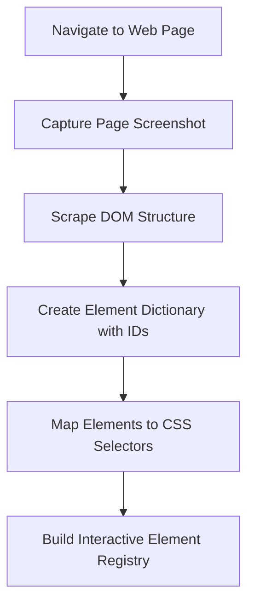
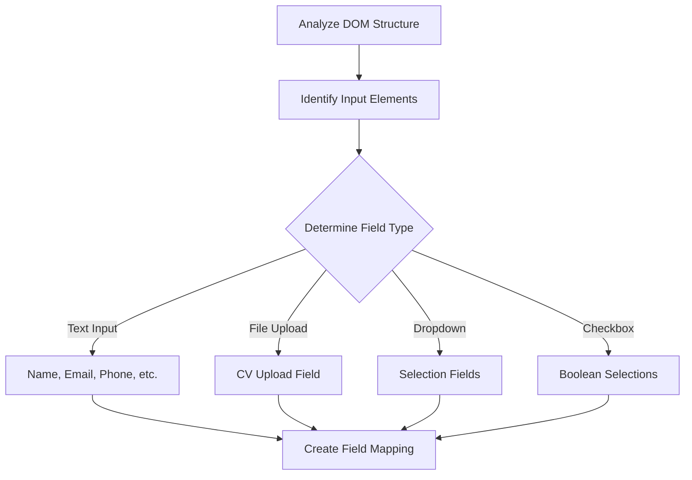
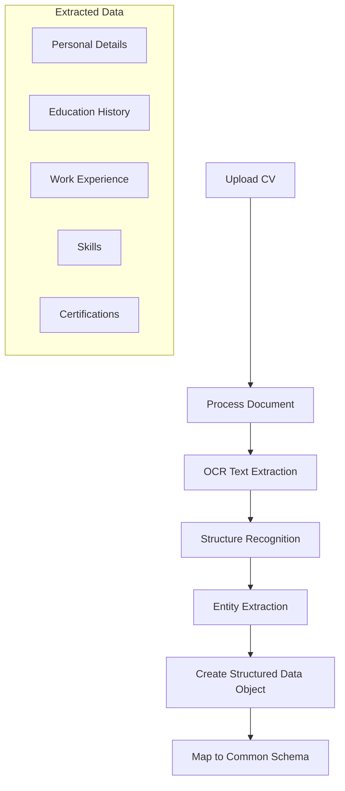
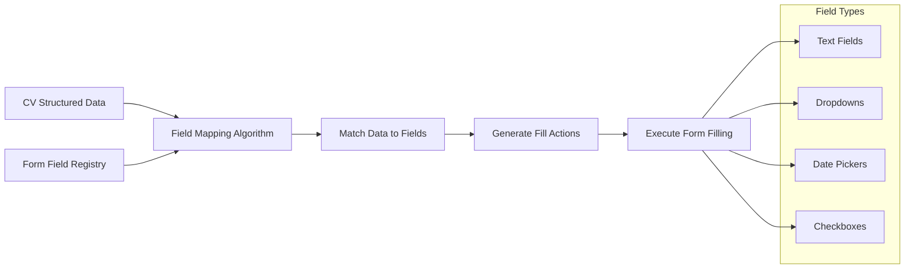
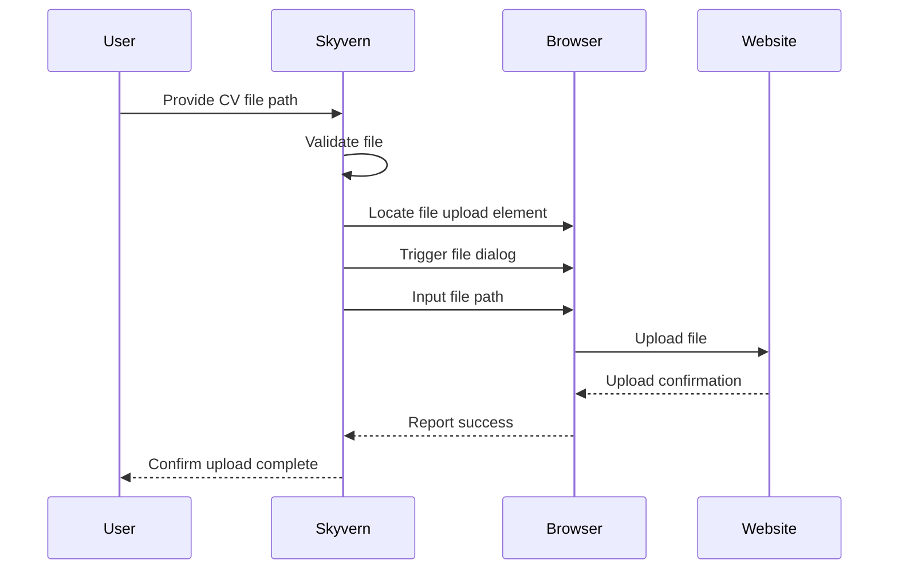
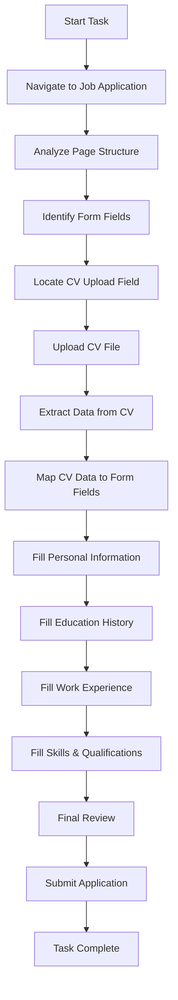

# How Skyvern Works: Form Field Detection and Automatic Filling

This document explains how Skyvern detects form fields in web applications and automatically fills them using data extracted from uploaded documents like CVs (resumes). We'll walk through the complete process using ASCII art and Mermaid diagrams.

## System Overview

Skyvern is an AI-powered browser automation tool that uses LLMs (Large Language Models) and computer vision to interact with websites. Unlike traditional automation tools that rely on brittle XPath selectors, Skyvern uses vision-based AI to understand and interact with web pages.

```
+-------------------+     +-------------------+     +-------------------+
|                   |     |                   |     |                   |
|  Web Browser      |     |  Skyvern Engine   |     |  AI Models (LLM)  |
|  (Chromium)       |<--->|  (Core Logic)     |<--->|  (Vision + Text)  |
|                   |     |                   |     |                   |
+-------------------+     +-------------------+     +-------------------+
```

## The CV Upload and Form Fill Process

Let's look at how Skyvern handles a resume upload and automatic form filling workflow:

```ascii
┌─────────────┐    ┌─────────────┐    ┌─────────────┐    ┌─────────────┐    ┌─────────────┐
│             │    │             │    │             │    │             │    │             │
│  1. Parse   │    │  2. Detect  │    │  3. Extract │    │  4. Fill    │    │  5. Submit  │
│     DOM     │───>│    Form     │───>│  Data from  │───>│    Form     │───>│    Form     │
│             │    │   Fields    │    │     CV      │    │   Fields    │    │             │
│             │    │             │    │             │    │             │    │             │
└─────────────┘    └─────────────┘    └─────────────┘    └─────────────┘    └─────────────┘
```

### Step by Step Explanation

#### 1. DOM Parsing and Page Analysis

When Skyvern navigates to a job application page, it first scrapes and analyses the DOM structure:



The DOM parsing creates a map of all elements on the page with unique identifiers, enabling Skyvern to interact with them later.

#### 2. Form Field Detection

Skyvern uses computer vision and DOM analysis to identify form fields:



For each field, Skyvern identifies:
- What type of field it is (text, file upload, dropdown, etc.)
- What data should be entered (based on field name, placeholder, label, etc.)
- Any validation requirements

#### 3. CV Data Extraction

When a CV is uploaded, Skyvern extracts structured data from it:



The CV processing uses OCR and NLP techniques to extract information like:
- Personal details (name, email, phone)
- Education history
- Work experience
- Skills and certifications

#### 4. Form Field Filling

Skyvern matches extracted CV data with the appropriate form fields:



The system uses intelligent mapping to match CV data with the appropriate fields, handling various field types:
- Simple text fields (name, email, phone)
- Complex fields (work experience, education)
- Selection fields (dropdowns, checkboxes)

#### 5. File Upload

For the CV file upload itself:



Skyvern handles the file upload by:
1. Finding the file input element
2. Triggering it to open the file dialog
3. Providing the file path
4. Waiting for upload confirmation

## Complete Process Flow

Here's a visualization of the entire CV upload and form filling process:



## Technical Implementation

The implementation involves several key components working together:

```
┌─────────────────────────────────────────────────────────────┐
│                     Skyvern Components                      │
├─────────────┬─────────────┬─────────────┬─────────────┬─────┘
│             │             │             │             │
│ DOM Parser  │ CV Extractor│ Field       │ Action      │
│ & Scraper   │ & Processor │ Detector    │ Executor    │
│             │             │             │             │
└─────┬───────┴──────┬──────┴──────┬──────┴──────┬──────┘
      │              │             │             │
      ▼              ▼             ▼             ▼
┌─────────────┬─────────────┬─────────────┬─────────────┐
│             │             │             │             │
│ HTML/CSS    │ Document    │ Form Field  │ Browser     │
│ Processing  │ Processing  │ Recognition │ Automation  │
│             │             │             │             │
└─────────────┴─────────────┴─────────────┴─────────────┘
```

### Key Technologies

1. **DOM Processing**
   - Element identification
   - CSS selector mapping
   - Element hierarchy analysis

2. **CV Processing**
   - OCR for text extraction
   - NLP for entity recognition
   - Data structuring

3. **Form Field Detection**
   - Input type classification
   - Label association
   - Field purpose identification

4. **Action Execution**
   - Text entry
   - File upload
   - Form submission

## Conclusion

The Skyvern system represents a powerful approach to automating web form filling and document uploads. By combining computer vision, natural language processing, and browser automation, it can intelligently understand web forms and extract data from documents to fill them automatically.

This document explained the core process of form field detection and filling, focusing on the CV upload example. The use of both DOM parsing and visual understanding makes Skyvern more robust than traditional automation tools that rely solely on CSS selectors or XPath.
