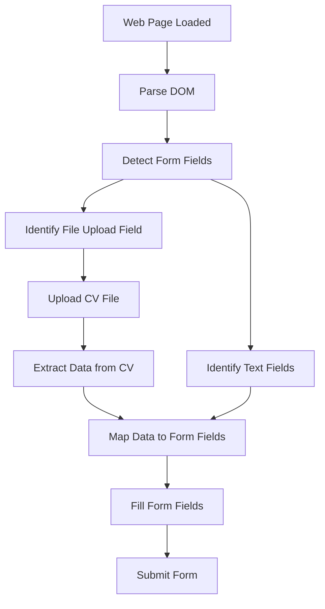

# How Skyvern Works

Skyvern is an intelligent application designed to automate form filling and file uploads on web pages. This document explains the core mechanism of how Skyvern detects form fields and fills them, using the example of uploading a CV and extracting data to populate a form.

## Overview of the Process

Skyvern uses advanced techniques to interact with web forms as a human would, identifying fields, understanding their purpose, and inputting relevant data. Here's a high-level view of the workflow:

```
+-------------------+      +-------------------+      +-------------------+
| Web Page Analysis | ---> | Form Field        | ---> | Data Extraction   |
| (DOM Parsing)     |      | Detection         |      | & Form Filling    |
+-------------------+      +-------------------+      +-------------------+
```

## Detailed Workflow with CV Upload Example

Let's break down the process using a practical example of uploading a CV and filling out a job application form:

### 1. Web Page Analysis
Skyvern starts by analyzing the web page's structure, parsing the DOM to understand the layout and elements present.

```
[Web Page]
   |
   v
[DOM Tree] ----> [Identify Forms & Inputs]
```

### 2. Form Field Detection
Using AI models, Skyvern detects and classifies form fields (e.g., text inputs, file upload buttons) based on their attributes, labels, and context.

```
[Form on Page]
   |
   v
[Field: Name]      [Field: Email]     [Field: Upload CV]
(Type: Text)       (Type: Text)       (Type: File)
```

### 3. Data Handling (CV Upload & Extraction)
Skyvern uploads the CV file to the designated field and extracts relevant data (like name, email, experience) from the CV using natural language processing.

```
[User uploads CV.pdf]
   |
   v
[CV Upload Field] ----> [File Uploaded Successfully]
   |
   v
[Extract Data: Name, Email, Skills]
```

### 4. Form Filling
The extracted data is then used to fill out the form fields accurately.

```
[Extracted Data]
   |
   v
[Name: John Doe] ----> [Fill Name Field]
[Email: john.doe@example.com] ----> [Fill Email Field]
```

## Mermaid Diagram of the Process

Below is a flowchart illustrating the process of form detection, CV upload, data extraction, and form filling:



## Explanation of Key Steps

- **Web Page Loaded & Parse DOM**: Skyvern loads the target web page and parses its DOM to understand the structure.
- **Detect Form Fields**: Using machine learning, it identifies interactive elements like text inputs and buttons.
- **Identify File Upload & Text Fields**: Specifically looks for fields meant for file uploads (like a CV) and text inputs (like name or email).
- **Upload CV File**: Automates the file selection and upload process.
- **Extract Data from CV**: Uses NLP to pull out relevant information from the uploaded CV.
- **Map Data to Form Fields**: Matches extracted data to the correct form fields based on field labels and types.
- **Fill Form Fields**: Inputs the data into the form.
- **Submit Form**: If instructed, submits the completed form.

This process ensures that Skyvern can handle complex web interactions with high accuracy, mimicking human behavior in form filling tasks.
