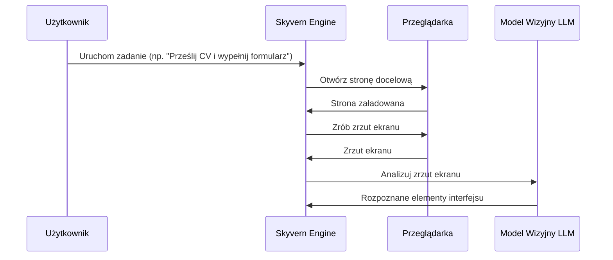
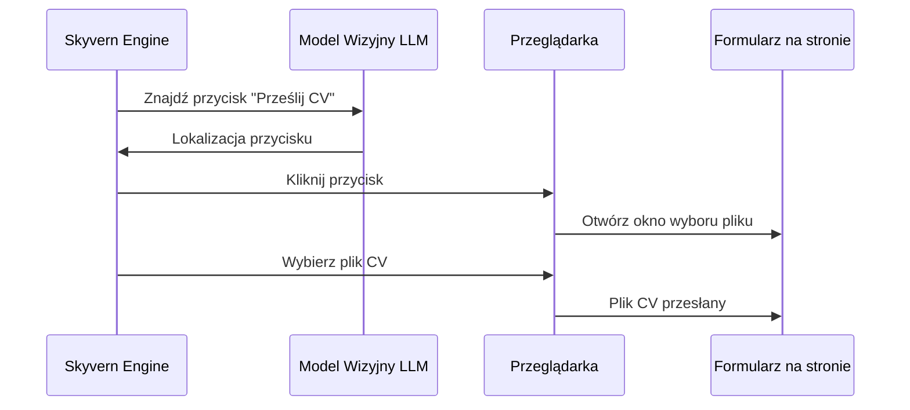
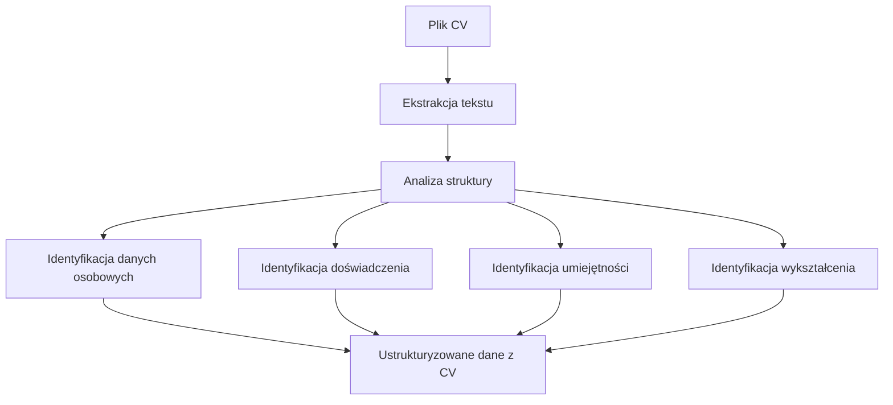
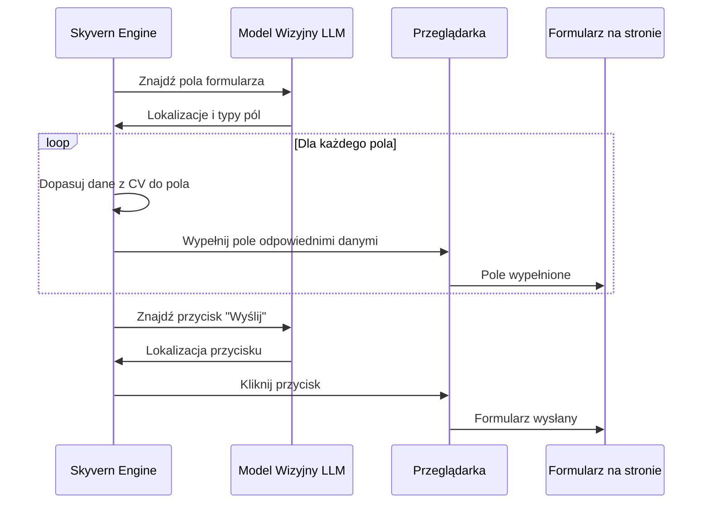

# Skyvern: Jak działa automatyzacja formularzy

## Wprowadzenie

Skyvern to zaawansowane narzędzie do automatyzacji procesów w przeglądarce internetowej, które wykorzystuje sztuczną inteligencję (LLM - Large Language Models) oraz technologię wizyjną (Computer Vision) do interakcji ze stronami internetowymi. W przeciwieństwie do tradycyjnych narzędzi automatyzacji, które polegają na selektorach DOM i XPath, Skyvern "widzi" i "rozumie" interfejs strony podobnie jak człowiek.

Ten dokument wyjaśnia, w jaki sposób Skyvern wykrywa i wypełnia pola formularzy, ze szczególnym uwzględnieniem procesu przesyłania CV i automatycznego wypełniania formularzy danymi z CV.

## Architektura systemu

```ascii
+-------------------+      +-------------------+      +-------------------+
|                   |      |                   |      |                   |
|  Zadanie użytk.   |----->|  Silnik Skyvern   |----->|  Przeglądarka    |
|  (Task)           |      |  (Engine)         |      |  (Browser)        |
|                   |      |                   |      |                   |
+-------------------+      +-------------------+      +-------------------+
                                    |
                                    v
                           +-------------------+
                           |                   |
                           |  Model wizyjny    |
                           |  (Vision LLM)     |
                           |                   |
                           +-------------------+
```

## Proces detekcji i wypełniania formularzy

### 1. Przechwytywanie widoku strony



### 2. Identyfikacja pól formularza

Skyvern wykorzystuje model wizyjny LLM do identyfikacji pól formularza na stronie. Model analizuje zrzut ekranu i rozpoznaje różne typy elementów interfejsu:

```ascii
+----------------------------------------------------+
|                                                    |
|  +------------+  +------------+  +------------+    |
|  | Pole imię  |  | Pole nazw. |  | Pole email |    |
|  +------------+  +------------+  +------------+    |
|                                                    |
|  +------------------------------------------+      |
|  | Pole doświadczenie                       |      |
|  +------------------------------------------+      |
|                                                    |
|  +------------+  +----------------------------+    |
|  | Przycisk   |  | Przycisk "Prześlij CV"    |    |
|  | "Wyczyść"  |  |                           |    |
|  +------------+  +----------------------------+    |
|                                                    |
+----------------------------------------------------+
```

### 3. Proces przesyłania CV



### 4. Ekstrakcja danych z CV



### 5. Wypełnianie formularza danymi z CV



## Jak to działa w praktyce

### Przykład: Przesyłanie CV i wypełnianie formularza rekrutacyjnego

1. **Inicjalizacja zadania**:
   ```python
   from skyvern import Skyvern

   skyvern = Skyvern()
   task = await skyvern.run_task(
       prompt="Przejdź na stronę rekrutacyjną, prześlij moje CV i wypełnij formularz danymi z CV"
   )
   ```

2. **Skyvern analizuje stronę**:
   - Otwiera przeglądarkę i nawiguje do strony rekrutacyjnej
   - Wykonuje zrzut ekranu strony
   - Używa modelu wizyjnego LLM do analizy interfejsu

3. **Przesyłanie CV**:
   - Identyfikuje przycisk "Prześlij CV" lub pole do przeciągnięcia pliku
   - Wykonuje akcję przesłania pliku CV

4. **Ekstrakcja danych z CV**:
   - Analizuje zawartość CV
   - Identyfikuje kluczowe informacje (imię, nazwisko, dane kontaktowe, doświadczenie, umiejętności)

5. **Wypełnianie formularza**:
   - Identyfikuje pola formularza na stronie
   - Dopasowuje dane z CV do odpowiednich pól
   - Automatycznie wypełnia formularz

6. **Finalizacja**:
   - Weryfikuje poprawność wypełnienia
   - Wysyła formularz (jeśli wymagane)

## Przewaga nad tradycyjnymi metodami automatyzacji

```ascii
+--------------------------------------+--------------------------------------+
|         Tradycyjne metody            |             Skyvern                  |
+--------------------------------------+--------------------------------------+
| - Oparte na selektorach DOM/XPath    | - Oparte na wizualnym zrozumieniu    |
| - Łamią się przy zmianach w UI       | - Odporność na zmiany w UI           |
| - Wymagają stałej aktualizacji       | - Adaptuje się do nowych interfejsów |
| - Trudne w utrzymaniu                | - Łatwiejsze w utrzymaniu            |
| - Ograniczone do konkretnych stron   | - Działa na różnych stronach         |
+--------------------------------------+--------------------------------------+
```

## Wyzwania i ograniczenia

1. **Złożone formularze** - Formularze z niestandardowymi kontrolkami mogą wymagać dodatkowej konfiguracji
2. **Captcha i zabezpieczenia** - Niektóre strony mogą mieć zabezpieczenia przeciwko automatyzacji
3. **Dynamicznie generowane strony** - Strony z dużą ilością dynamicznie generowanej zawartości mogą stanowić wyzwanie

## Podsumowanie

Skyvern reprezentuje nowe podejście do automatyzacji procesów w przeglądarce, wykorzystując sztuczną inteligencję i modele wizyjne do interakcji ze stronami internetowymi w sposób podobny do człowieka. Dzięki temu może skutecznie wykrywać i wypełniać formularze, nawet gdy zmienia się struktura strony, co czyni go bardziej niezawodnym i elastycznym narzędziem w porównaniu do tradycyjnych metod automatyzacji.
